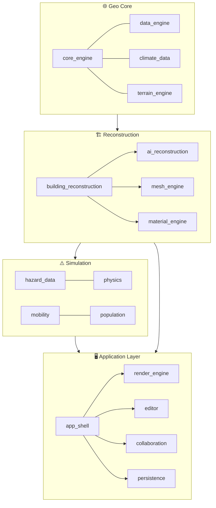

<div align="center">


<h1>🌍 Geospatial Digital Twin Platform</h1>

<p><b>Turn satellite imagery and map data into a living, interactive 3D digital twin of a city — buildings, hazards, mobility, and real-time collaboration in one platform.</b></p>

<p>
  
  
  <a href="LICENSE"></a>
  
  
  
</p>

<p>
  
  
  
</p>

<p>
  <a href="#-key-features">Features</a> •
  <a href="#-architecture">Architecture</a> •
  <a href="#-installation">Installation</a> •
  <a href="#-quick-start">Quick Start</a> •
  <a href="#-testing">Testing</a> •
  <a href="#-contributing">Contributing</a> •
  <a href="#-license">License</a>
</p>

</div>

---

## 📖 Overview

**Geospatial Digital Twin Platform** is an end-to-end system that turns real-world satellite imagery, OpenStreetMap data, and elevation models into a **living, interactive 3D digital twin** of a city or region. It spans everything from parametric 3D building reconstruction to earthquake/flood/fire simulation, traffic and crowd modeling, and real-time multi-user collaboration.

The codebase includes **~115,000 lines of Python**, **39 independent modules**, and **175+ tests**. The core platform is deliberately **stdlib-only** (zero required dependencies); advanced capabilities (ML-based prediction, full CRS transforms, PostGIS, MQTT/IoT, LLM integration) are opt-in extras that gracefully fall back to built-in heuristics when not installed.

<details>
<summary><b>📋 Table of Contents</b></summary>

- [Key Features](#-key-features)
- [Architecture](#-architecture)
- [Installation](#-installation)
- [Quick Start](#-quick-start)
- [Docker](#-docker)
- [Testing](#-testing)
- [Project Structure](#-project-structure)
- [Documentation](#-documentation)
- [Roadmap Philosophy](#-roadmap-philosophy)
- [Contributing](#-contributing)
- [License](#-license)

</details>

## ✨ Key Features

<table>
<tr>
<td width="50%" valign="top">

### 🏗️ Building & Terrain Reconstruction
- Full parametric 3D generation from building footprints — floors, roof typology, façade/window/door layout
- AI-assisted prediction (height, material, roof type) with automatic fallback to rule-based heuristics
- Curved façades, double-skin envelopes, procedural interiors
- Terrain integration with erosion/hydrology simulation

### 🌐 Digital Twin & Geo Core
- Real coordinate systems (EPSG/UTM), point cloud processing (LAS/LAZ), OSM/map layers
- IoT bridge (optional MQTT), real-time data streaming (`reality_feed`)
- Multi-level hierarchy management (building → floor → room → object)

### ⚠️ Hazard & Risk Simulation
- Earthquake (PGA estimation, building shake/damage models), fire spread, flood/landslide
- City-scale evacuation planning, cascading hazard rules, resilience timeline
- Live AFAD / USGS data clients

</td>
<td width="50%" valign="top">

### 🚦 Mobility & Population
- Traffic simulation, adaptive signal control, transit modeling
- Crowd simulation (behavior rules, capacity analysis, fire evacuation)
- Synthetic population generation and daily activity modeling

### 🖥️ Render, Editor & Collaboration
- Real-time software rasterizer, LOD/streaming, scene instancing
- Blender-like editor: gizmos, command system, undo/redo
- CRDT-based real-time multi-user collaboration, role-based auth (viewer/editor/owner)
- WebSocket API, REST API, plugin system, sandboxed scripting

### 📤 Export & Environmental Analysis
- CityGML, CityJSON, IFC, 3D Tiles, GeoTIFF export
- Field survey pipeline: RINEX/GNSS adjustment, total station, drone GCP, point cloud ICP
- Sun/shadow simulation, visibility analysis, thermal comfort, microclimate & air quality

</td>
</tr>
</table>

## 🏛️ Architecture

The platform is organized into **39 independent modules**, each owning a single responsibility:



| Layer | Modules |
|---|---|
| **Geo Core** | `core_engine`, `data_engine`, `climate_data`, `terrain_engine` |
| **Building & Reconstruction** | `building_reconstruction`, `ai_reconstruction`, `mesh_engine`, `material_engine`, `lighting` |
| **Digital Twin** | `digital_twin`, `feature_survey`, `offline_cache` |
| **Hazard & Risk** | `hazard_data`, `physics` |
| **Mobility & Population** | `mobility`, `population` |
| **City Infrastructure** | `power_infrastructure`, `street_furniture`, `religious_structures`, `sport_recreation`, `commerce_props`, `vegetation` |
| **Render & Visualization** | `render_engine`, `visualization`, `editor` |
| **Analysis** | `analysis_engine` |
| **Application Layer** | `app_shell`, `collaboration`, `persistence`, `extensibility`, `i18n` |
| **AI Assistant** | `ai_assistant` |
| **Export** | `export` |
| **Infrastructure** | `observability`, `security`, `performance`, `simulation_core` |

Each module ships its own `README.md` with implementation details — see e.g. [`digital_twin/README.md`](digital_twin/README.md) or [`mobility/README.md`](mobility/README.md).

## 📦 Installation

```bash
git clone https://github.com/kaandevs-ops/geospatial-digital-twin.git
cd geospatial-digital-twin

# Core (stdlib-only, zero dependencies)
pip install -e .

# With development tools (pytest, ruff, mypy)
pip install -e ".[dev]"

# Optional extras — mix and match as needed
pip install -e ".[ml]"        # scikit-learn / onnxruntime based ML prediction
pip install -e ".[geo]"       # pyproj for full CRS/datum transforms
pip install -e ".[cloud]"     # compressed LAZ point cloud support
pip install -e ".[postgres]"  # PostgreSQL + PostGIS persistence backend
pip install -e ".[iot]"       # real MQTT broker integration
pip install -e ".[survey]"    # full RINEX/GNSS field survey pipeline
```

> **Note:** missing an optional extra never silently disables a feature — the platform either falls back to a built-in heuristic/statistical equivalent, or raises a clear, explicit error if no fallback exists.

## 🚀 Quick Start

```bash
python -m harita.app_shell.server --port 8765
# open http://127.0.0.1:8765 in your browser
```

## 🐳 Docker

```bash
docker build -t geospatial-digital-twin .
docker run -p 8765:8765 -v geo-data:/home/harita/.harita geospatial-digital-twin
```

## 🧪 Testing

```bash
pytest                 # 175+ tests
ruff check .            # lint
ruff format .            # formatting
mypy .                  # static type checking (gradual, warning-level)
```

## 📁 Project Structure

```
.
├── core_engine/              # Geo core: coordinate systems, GIS, tile engine
├── building_reconstruction/  # 3D building generation from footprints
├── ai_reconstruction/        # ML/heuristic prediction layer (height, material, roof)
├── digital_twin/             # Hierarchy, IoT bridge, real-time data streaming
├── hazard_data/              # Earthquake, fire, flood/landslide risk models
├── mobility/                 # Traffic, crowd, and transit simulation
├── analysis_engine/          # Measurement, visibility, sun/environmental simulation
├── render_engine/            # Real-time rendering, LOD, streaming
├── editor/                   # 3D scene editor
├── collaboration/            # Multi-user collaboration (CRDT, auth, WebSocket)
├── export/                   # CityGML / CityJSON / IFC / 3D Tiles export
├── feature_survey/           # RINEX/GNSS/LiDAR field survey pipeline
├── persistence/              # Project save/load (SQLite / PostgreSQL)
├── app_shell/                # Web UI and HTTP/REST server
├── extensibility/            # Plugin system, script API, macros
├── scripts/                  # Version bumping, changelog, quality-check scripts
├── tests/                    # 175+ test files
├── docs/                     # API, user, and developer documentation
├── Dockerfile                # Multi-stage, stdlib-only runtime image
└── pyproject.toml            # Package metadata and optional dependencies
```

## 🗺️ Documentation

| Document | Content |
|---|---|
| [`docs/API.md`](docs/API.md) | REST/WebSocket API reference |
| [`docs/USER_GUIDE.md`](docs/USER_GUIDE.md) | User guide |
| [`docs/DEVELOPER_GUIDE.md`](docs/DEVELOPER_GUIDE.md) | Developer guide and coding standards |
| [`docs/AI_INTEGRATION_MAP.md`](docs/AI_INTEGRATION_MAP.md) | AI integration points |

## 🧭 Roadmap Philosophy

Internal roadmaps, phase-by-phase progress logs, and audit reports are kept in a private working tree and are intentionally not part of this public repository. What you see here is the shipped, tested code plus the documentation needed to use and extend it.

## 🤝 Contributing

Contributions are welcome! Please check existing issues before opening a new one, and open an issue to discuss significant changes before submitting a large PR.

1. Fork the repository
2. Create a feature branch (`git checkout -b feature/amazing-feature`)
3. Commit your changes (`git commit -m 'Add: amazing feature'`)
4. Push to your branch (`git push origin feature/amazing-feature`)
5. Open a Pull Request

Please make sure `pytest` and `ruff check .` pass before submitting a pull request.

## 📄 License

This project is licensed under the [Apache License 2.0](LICENSE).

---

<div align="center">

Built by [**@kaandevs-ops**](https://github.com/kaandevs-ops)

⭐ If you find this project useful, consider giving it a star!

</div>
