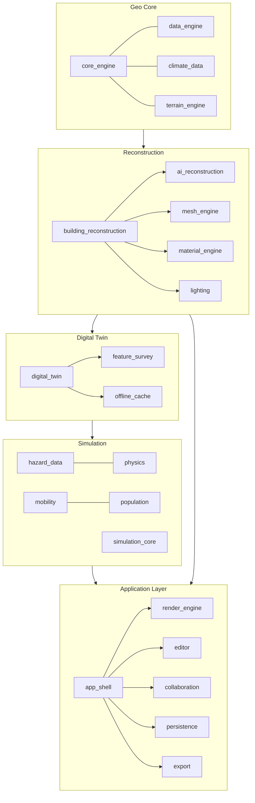

# Harita Modelleme Platformu (Geospatial Digital Twin Platform)

Turns building footprints, OSM/map data, and optional survey inputs into a **parametric 3D digital twin of a city** — with hazard simulation (earthquake, fire, flood), mobility/crowd modeling, real-time multi-user collaboration, and CityGML/CityJSON/IFC export — served by a REST + WebSocket application shell.

<p>
  
  
  
  
  
  
  
</p>

> **License notice:** the repository is Apache License 2.0 — both the root `LICENSE` file and `pyproject.toml` (`license = { text = "Apache-2.0" }`) agree. See [Project Status & License](#project-status--license).

---

## Table of Contents

- [Overview](#overview)
- [Architecture](#architecture)
- [Data / Sensor Pipeline](#data--sensor-pipeline)
- [Core Components](#core-components)
- [Technology Stack](#technology-stack)
- [Installation](#installation)
- [Configuration](#configuration)
- [Quick Start](#quick-start)
- [Docker](#docker)
- [API Reference](#api-reference)
- [Data / Event Contracts](#data--event-contracts)
- [Error Handling & Reliability](#error-handling--reliability)
- [Testing](#testing)
- [Performance](#performance)
- [Security](#security)
- [Observability](#observability)
- [Engineering Principles](#engineering-principles)
- [Project Structure](#project-structure)
- [Project Status & License](#project-status--license)
- [Roadmap](#roadmap)
- [Limitations](#limitations)
- [Contributing](#contributing)

---

## Overview

The repository root is itself the importable `harita` package (there is no separate `harita/` subdirectory — the root `__init__.py` plus a custom `setup.py` package-discovery step wrap the top-level module folders as `harita.<module>`, e.g. `harita.app_shell`). It's a **~115,000-line** Python codebase (package + tests) organized into **37 independent top-level modules**, with **167 test files / 2,500+ test functions**. The core is deliberately **stdlib-only** — zero required runtime dependencies (`dependencies = []` in `pyproject.toml`). Everything that needs a third-party library (ML inference, full CRS/datum transforms, compressed LAZ, PostgreSQL/PostGIS, real MQTT brokers, RINEX/GNSS parsing) is an **optional extra** (`pip install -e ".[ml,geo,...]"`) that is imported lazily and, where a fallback exists, degrades to a built-in heuristic instead of failing silently or crashing at import time.

It answers three broad problems:

1. **Turn 2D footprints/OSM data into parametric 3D buildings** (floors, roofs, façades, materials), optionally augmented with drone/GNSS/LiDAR field survey data.
2. **Simulate what happens to that city model** — earthquakes (PGA + building risk scoring), fire spread, flood/landslide terrain risk, traffic, crowd evacuation.
3. **Let multiple users edit and view the same digital twin in real time** through a CRDT-based collaboration layer, a REST/WebSocket API, and a browser-based editor/renderer, then export the result to industry-standard GIS/BIM formats (CityGML, CityJSON, IFC, 3D Tiles).

## Architecture



`app_shell` is the single integration point: it wires `session.py` (an `AppSession` façade over persistence, reconstruction, hazard, mobility, simulation, feature-survey, and export modules) to `api.py` (a hand-rolled REST router) and serves both the JSON API and the static web UI via `http.server.ThreadingHTTPServer` — no web framework dependency.

Each module ships its own `README.md` with implementation-level detail — see e.g. [`digital_twin/README.md`](digital_twin/README.md), [`mobility/README.md`](mobility/README.md), [`collaboration/README.md`](collaboration/README.md).

## Data / Sensor Pipeline

The platform has two related but distinct "input → output" pipelines worth documenting separately.

### 1. Reconstruction pipeline (footprint → 3D model)

```text
Footprint / OSM tag / field-survey point cloud
        │
        ▼
core_engine.gis_core (osm_client, point_cloud, elevation_client)
        │
        ▼
ai_reconstruction  ──(optional sklearn/onnxruntime model)──►  fallback: rule-based heuristic
        │  (height, roof type, material predictions)
        ▼
building_reconstruction  (floors, roof_generator, façade/window layout)
        │
        ▼
mesh_engine + material_engine + lighting
        │
        ▼
digital_twin (hierarchy: building → floor → room → object)
        │
        ▼
render_engine / editor / export (CityGML, CityJSON, IFC, 3D Tiles, glTF, OBJ...)
```

`ai_reconstruction` explicitly does **not** hide the absence of a trained model: if the `[ml]` extra (`scikit-learn`, `onnxruntime`) is not installed, prediction calls fall back to a documented rule-based heuristic rather than pretending to be ML-driven.

### 2. Live telemetry / sensor pipeline (`digital_twin`)

```text
Physical or simulated sensor
        │
        ▼
digital_twin.iot_bridge.TopicBus        (stdlib-only pub/sub; MQTT-style
        │                                 hierarchical topics, +/# wildcards,
        │                                 QoS-0 "at most once" delivery)
        │
        ├──(optional paho-mqtt, `[iot]` extra)──► MqttBridge → real MQTT broker
        │        (raises MqttBackendUnavailable, not a silent no-op, if absent)
        ▼
digital_twin.iot_bridge.SensorIotBinding
        │  subscribes a DigitalTwin's SensorBinding to a topic
        ▼
DigitalTwin.update_sensor(sensor_id, value, timestamp)
        │
        ▼
TwinEvent (append-only event log on the twin)
```

`SensorBinding` (`digital_twin/__init__.py`) is the sensor record actually used by the platform:

```python
@dataclass(slots=True)
class SensorBinding:
    sensor_id: str
    sensor_type: str
    target_ref: str          # e.g. "floor:2" / "room:server_room_1" / "roof"
    unit: str = ""
    last_value: float | None = None
    last_updated: float | None = None
    metadata: dict = field(default_factory=dict)
```

Note the deliberate design boundary: `SensorBinding` only caches the *last known* value and its binding target — it does not itself store a time series. Time-series generation for demos/tests lives in `digital_twin/hierarchy.py` (`SensorSeriesConfig`, sinusoidal + noise synthetic series), and real ingestion goes through `TopicBus`/`MqttBridge` above. There is currently **no persisted historical time-series store** — only the append-only `TwinEvent` log and the single last-value cache.

External hazard "sensors" (earthquake catalogs) follow a comparable acquire → normalize → score pipeline: `hazard_data.afad_client` / `hazard_data.usgs_client` fetch raw catalog data, `pga_estimate.py` converts it to a regional PGA estimate, and `risk_scoring.py` combines that with building metadata (construction year, floor count, soil type) into a `BuildingRiskReport` / `RVSReport` — explicitly framed in-code as an indicative score, not a certified structural engineering assessment.

## Core Components

| Component | Responsibility | Depends on | Exposes |
|---|---|---|---|
| `app_shell` | HTTP/REST + static file server, single-tenant session (`AppSession`) | almost every module below | `/api/*` REST routes (132 routes across projects, buildings, OSM, hazard, mobility, simulation, export) |
| `core_engine` | EPSG/UTM coordinate systems, GIS tile/OSM client, point-cloud (LAS) parsing, elevation | stdlib only (`geo` extra adds full pyproj CRS) | `gis_core.osm_client`, `coordinate_systems`, `tile_engine` |
| `building_reconstruction` | Parametric building generation: floors, 12 roof typologies, façade/window layout | `ai_reconstruction`, `mesh_engine`, `material_engine` | `ProceduralBuildingGenerator`-style API (see module README) |
| `ai_reconstruction` | Height/material/roof-type prediction with heuristic fallback | optional `scikit-learn`/`onnxruntime` (`ml` extra) | prediction functions used by `building_reconstruction` |
| `digital_twin` | Multi-level hierarchy (building→floor→room→object), sensor bindings, IoT bridge, event log | stdlib only (`iot` extra adds real MQTT) | `DigitalTwin`, `TwinHierarchy`, `TopicBus`, `MqttBridge` |
| `hazard_data` | Earthquake catalog clients (AFAD/USGS), PGA estimation, building risk scoring, fire spread, flood/landslide, cascading hazards, evacuation priority, resilience timeline | stdlib only (network calls) | `AFADClient`, `USGSClient`, `PGAEstimateResult`, `BuildingRiskReport`, `FireSpreadModel`, `TerrainHazardAnalyzer` |
| `mobility` | Traffic simulation, signal control, transit, pathfinding | `physics`, `population` | route/traffic-impact API used by `app_shell` |
| `population` | Synthetic population + daily activity generation | — | population inputs for `mobility`/evacuation |
| `simulation_core` | Scenario storage, agent-based evacuation runner, capacity-analysis batch runner | `mobility`, `hazard_data`, `digital_twin` | `/api/projects/<id>/simulation/*` |
| `collaboration` | Auth (roles: viewer/editor/owner), CRDT document sync, WebSocket session server | stdlib only | `AuthService`, `ws_server`, `crdt` |
| `persistence` | Project save/load; SQLite backend used in production path, optional Postgres+PostGIS backend | `postgres` extra for Postgres | `ProjectManager`, `db_backend.ProjectDatabase`, `postgres_backend.PostgresProjectDatabase` |
| `export` | CityGML, CityJSON, IFC (STEP), 3D Tiles, glTF/OBJ/STL/PLY, DXF/USD/FBX stubs | stdlib only | `CityGMLExporter`, `CityJSONExporter`, `IFCExporter`, geometry exporters |
| `feature_survey` | RINEX/GNSS field observation parsing, total-station and drone GCP import, point-cloud ICP, WebODM orchestration | `survey`/`cloud` extras for full pipeline | `/api/projects/<id>/feature-survey/*` |
| `render_engine` / `editor` | Software rasterizer, LOD/streaming, scene instancing, Blender-style gizmo/command/undo-redo editor | — | serves the browser front-end |
| `observability` | Structured logging, Prometheus-format metrics, request instrumentation | stdlib only | `/api/metrics`, `/api/health` |
| `performance` | GPU/memory profiling, hardware timing bridge | stdlib only | `/api/performance/gpu-timing` |
| `security` | Rate limiting (sliding window), input hardening | stdlib only | applied inline in `app_shell.api` |
| `ai_assistant` | Building-command assistant with pluggable LLM providers | stdlib `urllib` for API-key providers; optional `llama-cpp-python` for local GGUF | `/api/projects/<id>/buildings/<key>/assistant` |

## Technology Stack

**Core:** Python ≥3.10, stdlib `http.server` (REST server), stdlib-only geometry/GIS/simulation code — no required third-party runtime dependency.

**Data:** SQLite (`persistence/db_backend.py`, always available) with an optional PostgreSQL + PostGIS backend (`persistence/postgres_backend.py`, `postgres` extra). No ORM.

**Optional extras** (all documented in `pyproject.toml` with an explicit fallback/failure behavior when absent):
| Extra | Adds | If absent |
|---|---|---|
| `ml` | `scikit-learn`, `onnxruntime` | `ai_reconstruction` falls back to rule-based heuristics |
| `geo` | `pyproj` | `core_engine` uses an internal EPSG/UTM table instead of full grid-shift/datum transforms |
| `cloud` | `laspy`, `lazrs` | compressed LAZ point clouds raise `UnsupportedFormatError`; uncompressed LAS still works (stdlib) |
| `postgres` | `psycopg` | persistence stays on the SQLite backend |
| `iot` | `paho-mqtt` | `MqttBridge.connect()` raises `MqttBackendUnavailable`; the in-process `TopicBus` still works |
| `survey` | `georinex`, `pyproj`, `cloud` | RINEX navigation-message / multi-frequency parsing unavailable; core RINEX 3.x observation parsing is stdlib-only and always works |
| `llm` | `llama-cpp-python` | local GGUF inference raises `ProviderUnavailableError`; OpenAI-compatible / Anthropic API-key providers (stdlib `urllib`) remain available regardless |
| `train` / `train-torch` / `train-tensorflow` | `Pillow`, `torch`/`tensorflow` | training pipeline under `ai_reconstruction/training/` unavailable; unrelated to runtime inference |
| `dev` | `pytest`, `pytest-cov`, `mypy`, `ruff` | — |

**Infrastructure:** Docker (multi-stage build, non-root user, `HEALTHCHECK` against `/api/health`), `docker-compose.yml` (app + optional Postgres data volume — Postgres wiring for `app_shell` is defined but **not yet read** by the application at runtime, see [Limitations](#limitations)).

**Testing/QA:** `pytest`, `ruff` (lint + format), `mypy` (gradual, non-strict).

**Observability:** custom structured logger (`observability/logging.py`), Prometheus-format metrics endpoint (`observability/metrics.py`), request instrumentation (`observability/instrumentation.py`).

## Installation

```bash
git clone https://github.com/kaandevs-ops/geospatial-digital-twin.git
cd geospatial-digital-twin

# Core (stdlib-only, zero runtime dependencies)
pip install -e .

# With development tools (pytest, ruff, mypy)
pip install -e ".[dev]"

# Optional extras — mix and match as needed
pip install -e ".[ml]"        # scikit-learn / onnxruntime ML prediction
pip install -e ".[geo]"       # pyproj for full CRS/datum transforms
pip install -e ".[cloud]"     # compressed LAZ point cloud support
pip install -e ".[postgres]"  # PostgreSQL + PostGIS persistence backend
pip install -e ".[iot]"       # real MQTT broker integration
pip install -e ".[survey]"    # full RINEX/GNSS field survey pipeline
pip install -e ".[llm]"       # local GGUF model inference
```

> Missing an optional extra never silently disables a feature: the platform either falls back to a built-in heuristic/statistical equivalent, or raises a clear, typed error (`UnsupportedFormatError`, `MqttBackendUnavailable`, `ProviderUnavailableError`, ...) if no fallback exists.

## Configuration

There is no `.env`/settings-file system; configuration is via CLI flags and a small number of environment variables read directly with `os.environ.get`:

| Variable | Required | Description | Default |
|---|---|---|---|
| `HARITA_REGISTRY_PATH` | No | Path to the project registry file used by `app_shell` | `~/.harita/registry.hprojreg` (CLI-resolved) |
| `ANTHROPIC_API_KEY` | Only if using the Anthropic LLM provider | API key for `ai_assistant.llm_providers.AnthropicProvider` | — |
| `HARITA_TEST_POSTGRES_DSN` | No (tests only) | DSN used by the optional Postgres persistence test suite | — |

`docker-compose.yml` also defines a `DATABASE_URL` environment variable on the `app` service; as of this version it is **not read** by `persistence.ProjectManager` or `app_shell` — it's reserved for a future multi-backend `ProjectManager` selection and currently has no effect. Never commit real credentials to `.env` files or configuration examples.

## Quick Start

```bash
python -m harita.app_shell.server --port 8765
# open http://127.0.0.1:8765 in your browser
```

The server is **single-tenant**: one process serves one `AppSession` backed by one registry file. Multi-tenant/multi-instance auth exists at the `collaboration` module level (roles, tokens) but is not yet wired as the default `app_shell` deployment mode.

## Docker

```bash
docker build -t geospatial-digital-twin .
docker run -p 8765:8765 -v harita-data:/home/harita/.harita geospatial-digital-twin
```

or via Compose (app + persistent volume):

```bash
docker-compose up
```

The image is a multi-stage build (`python:3.12-slim`), runs as a non-root user (`harita`, uid 10001), and defines a container `HEALTHCHECK` against `GET /api/health`.

## API Reference

`app_shell/api.py` implements a hand-rolled REST router (no framework) with **132 registered routes**. Selected examples — see `docs/API.md` for the fuller reference and `app_shell/api.py` for the authoritative source:

```http
GET /api/health
```
```json
{ "status": "ok" }
```

```http
GET /api/metrics
```
Returns Prometheus text-format metrics (`Content-Type: text/plain; version=0.0.4`).

```http
POST /api/projects/<id>/hazard/pga
Content-Type: application/json

{ "lat": 39.92, "lon": 32.85 }
```
→ `200` with a `PGAEstimateResult`-shaped body, or `422` if `lat`/`lon` are missing or non-numeric.

```http
POST /api/projects/<id>/hazard/building-risk
Content-Type: application/json

{
  "lat": 39.92, "lon": 32.85,
  "construction_year": 1998,
  "floor_count": 5,
  "soil_type": "bilinmiyor"
}
```
→ `200` with a `BuildingRiskReport` (indicative risk score — **not a certified engineering assessment**, as the module docstrings make explicit).

```http
POST /api/projects/<id>/simulation/evacuation/run
Content-Type: application/json

{ "scenario_id": "…", "max_time_s": 600.0, "keyframe_interval_s": 0.5 }
```
→ Runs the agent-based evacuation simulator and returns a result handle retrievable via `GET /api/projects/<id>/simulation/evacuation/<result_id>`.

Route families present in the router: `projects` (CRUD, open/close/save), `buildings` (create/regenerate/floors/undo-redo/AI assistant), `scene`/`section`/`explosion`/`measure`, `osm/import`+`preview`+`category-summary`, `export`, `analysis/sun`+`visibility`, `vegetation/scatter`, `feature-survey` (import, WebODM submit/status/fetch, orchestrate), `mobility/path`+`traffic-impact`, `hazard/*`, `simulation/*` (scenario, evacuation, capacity-analysis). Errors follow a consistent shape: `{"error": "<message>"}` with `400`/`422` status codes for validation failures.

Authentication/roles (`viewer`/`editor`/`owner`) and the CRDT collaboration WebSocket server exist as a separate layer (`collaboration/auth.py`, `collaboration/ws_server.py`) — see that module's README for how it's wired into multi-user sessions.

## Data / Event Contracts

**Sensor update** (`DigitalTwin.update_sensor`):
```json
{
  "sensor_id": "sensor-001",
  "sensor_type": "temperature",
  "target_ref": "floor:2",
  "unit": "C",
  "value": 22.4,
  "timestamp": 1735689600.0
}
```

**Twin event** (`TwinEvent`, appended to the twin's event log on every sensor update or state change) — see `digital_twin/__init__.py` for the exact field set.

**MQTT-style topic** (`TopicBus`): hierarchical, slash-delimited (e.g. `bina/1/kat/2/sicaklik`), supporting `+`/`#` wildcards and QoS-0 delivery — an in-process semantic clone of MQTT topic matching, not a protocol implementation.

## Error Handling & Reliability

- **Explicit-failure-over-silent-fallback** is a repository-wide convention for anything gated behind an optional dependency: `UnsupportedFormatError`, `MqttBackendUnavailable`, `ProviderUnavailableError`, `HazardNetworkError`, `HazardParseError`, `GLTFParseError`, `ManifestValidationError`, `CityModelValidationError`, `IFCValidationError` and similar typed exceptions are raised instead of returning partial/fake success.
- **Request validation** in `app_shell.api` catches `KeyError`/`TypeError`/`ValueError` per-route and returns `422` with a field-specific message rather than a bare 500.
- **DoS hardening**: `Content-Length` is bounds-checked before `rfile.read()` is ever called (`MAX_REQUEST_BODY_BYTES` = 16 MB for JSON bodies, `MAX_UPLOAD_BODY_BYTES` = 512 MB for file uploads), and a sliding-window rate limiter (`security`) throttles outbound OSM/Overpass calls to 10 requests / 60 s per project.
- **External data clients** (`hazard_data.afad_client`, `hazard_data.usgs_client`, `core_engine.gis_core.osm_client`) distinguish network failures from parse failures via dedicated exception types rather than a single catch-all.

## Testing

```bash
pytest                  # 167 test files, 2,500+ test functions
ruff check .             # lint
ruff format .             # formatting
mypy .                   # gradual, warning-level static typing
```

Most tests exercising external services (OSM Overpass, live ONNX inference, PROJ backend, scikit-learn wrapper) are **fixture/mock-driven by default** and only run against a real network when explicitly enabled — a small subset of files gate themselves behind reachability checks (e.g. `_overpass_reachable()`). No numeric line/branch coverage percentage is currently measured or published; `pytest-cov` is available as a dev dependency but a coverage report is not generated as part of this repository's documented workflow. (Internal audit notes referenced elsewhere in project history are kept in a private working tree and are not part of this public repository — see [Roadmap](#roadmap).)

## Performance

No formal, published benchmark suite or numeric throughput/latency figures currently ship with the repository. `performance/profiler.py` provides GPU/memory profiling hooks and an `/api/performance/gpu-timing` endpoint for client-reported frame timing, but this is instrumentation, not a benchmark result. Treat any performance claim not backed by a number in this repository as unverified.

## Security

- **Auth & roles**: `collaboration/auth.py` implements token-based auth with `viewer`/`editor`/`owner` roles, expiring tokens, and login-attempt throttling (`TooManyLoginAttemptsError`).
- **Rate limiting**: sliding-window limiter applied to outbound OSM import calls (see Error Handling above).
- **Request-size limits**: hard caps on JSON and upload body sizes, enforced before the body is read.
- **Secrets**: read from environment variables only (`ANTHROPIC_API_KEY`); none are hardcoded or logged.
- **Not yet present**: no CI-enforced dependency vulnerability scanning, no sandboxing beyond the non-root Docker user, and `app_shell` runs single-tenant without the `collaboration` auth layer wired in as a default — treat direct `app_shell` deployments as trusted-network-only unless you've integrated the `collaboration` auth/WebSocket layer yourself.

## Observability

- **Structured logging** — `observability/logging.py`.
- **Metrics** — Prometheus text-format exposition at `GET /api/metrics` (only registered if a `MetricsRegistry` is configured).
- **Health check** — `GET /api/health`, also used by the Docker `HEALTHCHECK` directive.
- **Request instrumentation** — `observability/instrumentation.py` wraps the router (`InstrumentedRouter`).
- No distributed tracing (OpenTelemetry or similar) is present.

## Engineering Principles

Observed directly in the codebase, not aspirational:

- **Stdlib-only core with opt-in extras** — enforced at the `pyproject.toml` level (`dependencies = []`) and honored consistently in every module that touches an optional library.
- **Explicit failure over silent degradation** — see [Error Handling](#error-handling--reliability).
- **Module-level ownership** — 37 modules, each with a single responsibility and its own `README.md` (24 module READMEs present).
- **Layered hierarchy** (`digital_twin.TwinHierarchy`: building → floor → room → object) rather than a flat entity list.
- **Event sourcing for twin state** — `TwinEvent` append-only log rather than only mutating in place.
- **CRDT-based collaboration** for conflict-free concurrent multi-user editing rather than last-write-wins.

## Project Structure

```
.
├── core_engine/               # CRS, GIS tile/OSM client, point-cloud, elevation
├── data_engine/                # caching, spatial index, history
├── building_reconstruction/    # parametric 3D building generation
├── ai_reconstruction/          # ML/heuristic prediction layer (height, material, roof)
├── mesh_engine/ material_engine/ lighting/
├── digital_twin/                # hierarchy, sensor bindings, IoT bridge, event log
├── feature_survey/              # RINEX/GNSS/LiDAR/WebODM field survey pipeline
├── hazard_data/                 # earthquake/fire/flood/landslide risk models
├── physics/ simulation_core/
├── mobility/ population/
├── power_infrastructure/ street_furniture/ religious_structures/
│   sport_recreation/ commerce_props/ vegetation/    # city-object catalogs
├── render_engine/ visualization/ editor/
├── analysis_engine/             # measurement, visibility, sun/environment
├── app_shell/                   # HTTP server + REST router + static web UI
├── collaboration/                # CRDT sync, auth, WebSocket server
├── persistence/                  # SQLite (default) / PostgreSQL+PostGIS (optional)
├── extensibility/ i18n/
├── ai_assistant/                 # LLM-backed building command assistant
├── export/                       # CityGML / CityJSON / IFC / 3D Tiles / mesh formats
├── observability/ security/ performance/
├── scripts/                      # version bump, changelog extraction, QA scripts
├── tests/                        # 167 test files / 2,500+ tests
├── docs/                         # API.md, USER_GUIDE.md, DEVELOPER_GUIDE.md, ...
├── Dockerfile / docker-compose.yml
└── pyproject.toml
```

## Project Status & License

**Status:** Beta (`Development Status :: 4 - Beta` in `pyproject.toml` classifiers). Substantial real functionality exists across all 37 modules, but several documented gaps remain (see Limitations/Roadmap) and no CI configuration ships in this repository snapshot.

**License:** Apache License 2.0. The root `LICENSE` file and `pyproject.toml` (`license = { text = "Apache-2.0" }`) are consistent with each other.

## Roadmap

Internal, dated planning documents and phase-by-phase audit notes exist in the project's working history but are **not part of this public repository** — only the shipped, tested code and its documentation are published here. Rather than cite unpublished planning docs, two concrete, code-verifiable facts about where the implementation currently stands:

**More complete than a casual read of the module list would suggest:**
- `building_reconstruction/roof_generator` implements 12 roof typologies (flat, hip, gable, cross-gable, mansard, pyramid, sawtooth, industrial, modern, solar, green, dome) with a working per-type dispatch, not a skeleton.
- `building_reconstruction/regulations` has dedicated test coverage.

**Still open:**
- OSM Overpass integration has code (`core_engine.gis_core.osm_client`) but has not been exercised against a live Overpass endpoint in this repository's test suite — tests are fixture/mock-driven by default (see [Testing](#testing)).
- `mesh_engine/quality_metrics.py` (non-manifold edge count, floor-alignment tolerance) exists in the codebase but its output is not yet part of a published baseline report.

## Limitations

- **No CI configuration ships in this repository** (no `.github/workflows`); `ruff`/`mypy`/`pytest` must be run manually.
- **`DATABASE_URL` (docker-compose) is inert** — `persistence.ProjectManager`/`app_shell` only use the SQLite backend today, even though a Postgres+PostGIS backend (`persistence/postgres_backend.py`) exists and is tested independently.
- **No published performance benchmarks** — profiling hooks exist, but no benchmark report is checked into the repository.
- **No coverage percentage is published** — `pytest-cov` is available but not run as a documented step.
- **Single-tenant `app_shell` by default** — the collaboration/auth layer (roles, tokens) is a separate module and is not the default deployment path for `python -m harita.app_shell.server`.
- **Risk scores are explicitly indicative, not certified** — `hazard_data.risk_scoring` output (RVS/building risk reports) is framed in the source itself as a screening indicator, not a substitute for a licensed structural engineering assessment.

## Contributing

1. Fork the repository.
2. Create a feature branch (`git checkout -b feature/your-feature`).
3. Make sure `pytest`, `ruff check .`, and `mypy .` pass.
4. Open a Pull Request describing the change and, for anything touching an optional-extra code path, which extras you tested with/without.

---

Built by the Harita Modelleme Platformu maintainers.
